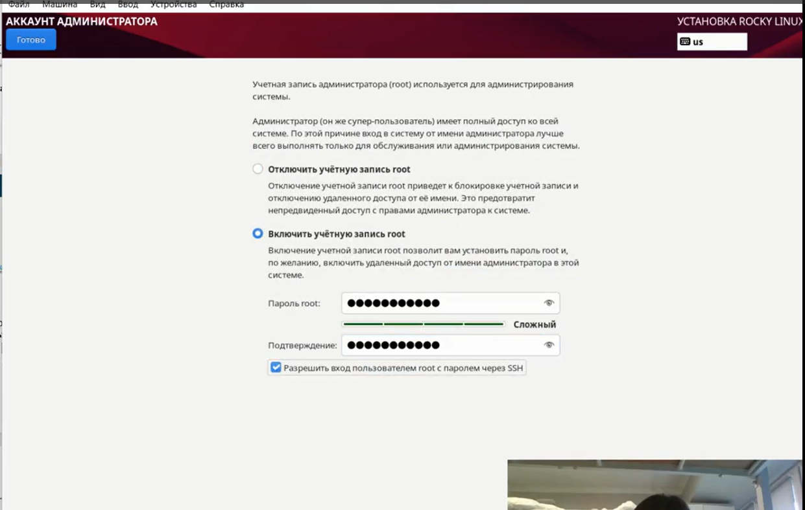
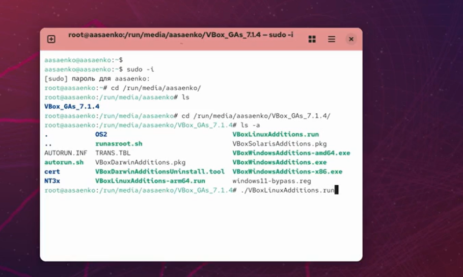

---
## Front matter
lang: ru-RU
title: Установка и конфигурация операционной системы на виртуальную машину
subtitle: Лабораторная работа № 1
author:
  - Саенко А. А.
institute:
  - Российский университет дружбы народов, Москва, Россия
 
date: 06 сентября 2025

## i18n babel
babel-lang: russian
babel-otherlangs: english

## Formatting pdf
toc: false
toc-title: Содержание
slide_level: 2
aspectratio: 169
section-titles: true
theme: metropolis
header-includes:
 - \metroset{progressbar=frametitle,sectionpage=progressbar,numbering=fraction}
---

# Информация

## Докладчик

:::::::::::::: {.columns align=center}
::: {.column width="70%"}

  * Саенко Ангелина Андреевна
  * студент
  * НПИбд-02-24
  * Российский университет дружбы народов
  * angelinasaenko867@gmail.com

:::
::: {.column width="30%"}

:::
::::::::::::::

# Вводная часть

## Актуальность

- Визуализация как основа современной IT-инфраструктуры 
- Изолированные среды для тестирования и разработки 
- Фундаментальные навыки для IT-специалистов

## Объект и предмет исследования

Объект :  процесс установки ОС на виртуальную машину 
Предмет :  методика установки и настройки 

## Цели и задачи
Цель : приобрести практические навыки установки операционной системы на виртуальную машину, настроить минимально необходимые для дальнейшей работы сервисы.
1. Установка VirtualBox
2. Установка Rocky Linux
3. Базовая конфигурация ОС
4. Изучение основных команд терминала

## Материалы и методы

- Практическая установка и поэтапная конфигурация
- VirtualBox, Rocky linux

# Подготовка виртуальной среды 

1. Установка и настройка VirtualBox
2. Создание виртуальной машины 

{#fig-040 width=70%}

# Установка операционной системы 
1. Загрузка с установочного насителя
2. Выбор языка 
3. Разметка диска и выбов файловой системы 
4. Настройка сетевых параметров и имени хоста

{#fig-042 width=70%}

# Базовая конфигурация ОС
1. Создание учётных записей 
2. Настройка прав доступа 
3. Установка паролей и отключение ненужных служб

{#fig-043 width=70%}

# Интеграция с гипервизором 
1. Настройка общих папок и буфера обмена 
2. Конфигурация графических драйверов 

{#fig-044 width=70%}
 
# Работа с терминалом и системой 
1. Изучение основных команд Linux
2. Работа с файловой системой и процессами 
3.  Анализ системных логов(dmesg)

{#fig-045 width=70%}

# Результаты
1. Создана виртуальная машина
2. Настроен каталог для виртуальных машин
3. Подключен образ Rocky Linux
4. Система настроена 
5. Домашнее задание выполнено 

# Спасибо за внимание 

## Спасибо за внимание!

