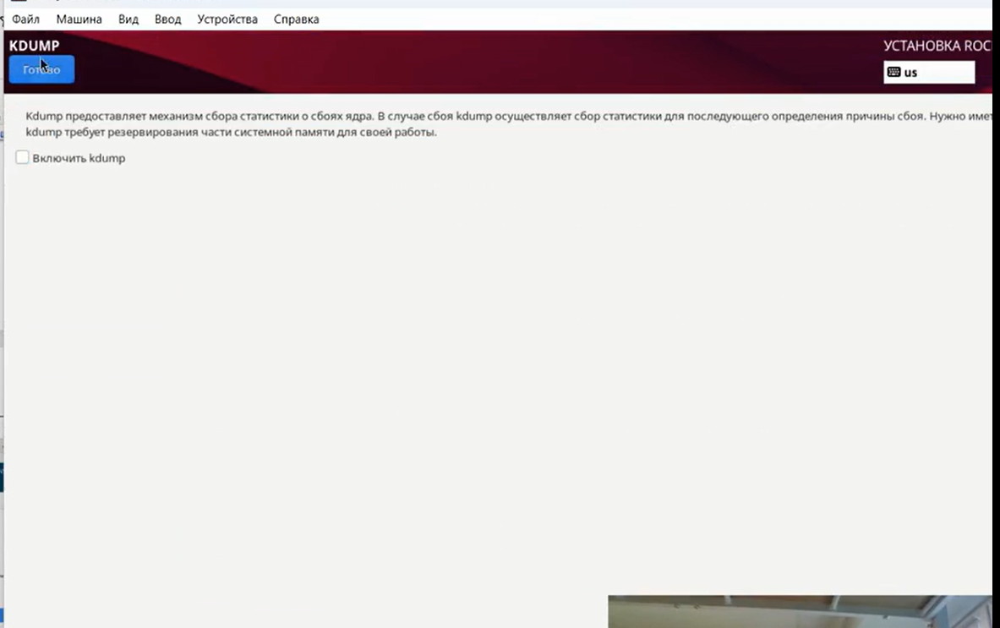
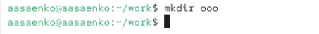

---
# Preamble

## Author
author:
  name: Саенко Ангелина Андреевна
  degrees: 
  orcid: 0000-0002-0877-7063
  email: angelinasaenko867@gmail.com
  affiliation:
    - name: Российский университет дружбы народов
      country: Российская Федерация
      postal-code: 117198
      city: Москва
      address: ул. Миклухо-Маклая, д. 6
## Title
title: "Отчёт по лабораторной работе №1"
subtitle: "Установка и конфигурация операционной системы на виртуальную машину"
license: "CC BY"
## Generic options
lang: ru-RU
number-sections: true
toc: true
toc-title: "Содержание"
toc-depth: 2
## Crossref customization
crossref:
  lof-title: "Список иллюстраций"
  lot-title: "Список таблиц"
  lol-title: "Листинги"
## Bibliography
bibliography:
  - bib/cite.bib
csl: _resources/csl/gost-r-7-0-5-2008-numeric.csl
## Formats
format:
### Pdf output format
  pdf:
    toc: true
    number-sections: true
    colorlinks: false
    toc-depth: 2
    lof: true # List of figures
    lot: true # List of tables
#### Document
    documentclass: scrreprt
    papersize: a4
    fontsize: 12pt
    linestretch: 1.5
#### Language
    babel-lang: russian
    babel-otherlangs: english
#### Biblatex
    cite-method: biblatex
    biblio-style: gost-numeric
    biblatexoptions:
      - backend=biber
      - langhook=extras
      - autolang=other*
#### Misc options
    csquotes: true
    indent: true
    header-includes: |
      \usepackage{indentfirst}
      \usepackage{float}
      \floatplacement{figure}{H}
      \usepackage[math,RM={Scale=0.94},SS={Scale=0.94},SScon={Scale=0.94},TT={Scale=MatchLowercase,FakeStretch=0.9},DefaultFeatures={Ligatures=Common}]{plex-otf}
### Docx output format
  docx:
    toc: true
    number-sections: true
    toc-depth: 2
---

# Цель работы

Целью данной работы является приобретение практических навыков установки операционной системы на виртуальную машину, настройки минимально необходимых для дальнейшей работы сервисов.

# Задание

Установить на виртуальную машину  VirtualBox операционную систему Linux (дистрибутив  Rocky).

# Выполнение лабораторной работы

Создадим виртуальную машину. Для этого укажем её имя - Rocky,тип операционной системы — Linux, версию операционной системы — RedHat (64-bit). Укажем путь к iso-образу устанавливаемого дистрибутива.

{#fig-001 width=70%}

Укажем размер основной памяти - 4096МБ  и число процессоров , равное 2.

{#fig-002 width=70%}

После чего зададим размер виртуального жёсткого диска - 40ГБ 

{#fig-003 width=70%}

Запустим виртуальную машину и в окне с меню переключимся на строку «Install Rocky
Linux версия», нажмём Enter для запуска установки образа ОС.

{#fig-004 width=70%}

В окне «Добро пожаловать в Rocky Linux...» выберем English в качестве языка
интерфейса 

{#fig-005 width=70%}

В разделе выбора программ укажем е в качестве базового окружения Server with GUI ,
а в качестве дополнения — Development Tools .

{#fig-006 width=70%}

Отключим  KDUMP.

{#fig-007 width=70%}

Место установки оставим без изменений.

{#fig-008 width=70%}

Включим сетевое соединение и в качестве имени узла укажем aasaenko.localdomain .

{#fig-009 width=70%}

Установим пароль для root, разрешение на ввод пароля для root при использовании
SSH .

{#fig-010 width=70%}

Затем зададим локального пользователя с правами администратора и пароль для него.

{#fig-011 width=70%}

После установки операционной системы корректно перезапустим виртуальную машину.

{#fig-012 width=70%}

Войдём в ОС под заданной вами при установке учётной записью.

{#fig-013 width=70%}

Подключим образ диска дополнений гостевой ОС через терминал (так как через графическое меню не получилось ).

{#fig-014 width=70%}

Установим имя пользователя и название хоста.

{#fig-015 width=70%}

{#fig-016 width=70%}

# Домашнее задание

Проанализируем последовательность загрузки системы, выполнив команду dmesg.

{#fig-017 width=70%}

Найдём версию ядра  Linux , для поиска используем команду dmesg | grep -i "то, что ищем"

{#fig-018 width=70%}

Найдём частоту процессора.

{#fig-019 width=70%}

Найдём модель процессора.

{#fig-020 width=70%}

Найдём объём доступной оперативной памяти.

{#fig-021 width=70%}

Найдём тип обнаруженного гипервизора.

{#fig-022 width=70%}

Найдём тип файловой системы корневого раздела и последовательность монтирования файловых систем.

{#fig-023 width=70%}

# Контрольные вопросы 
1. man ls – для получения справки по команде
   {#fig-024 width=70%}
   cd – для перемещения по файловой системе;
   {#fig-025 width=70%}
   ls – для просмотра содержимого каталога;
   {#fig-026 width=70%}
   du -sh – для определения объёма каталога;
   {#fig-027 width=70%}
   mkdir/rm/rmdir – для создания / удаления каталогов / файлов;
   {#fig-028 width=70%}
   chmod --help -для задания определённых прав на файл / каталог;
   {#fig-029 width=70%}
   history – для просмотра истории команд.
   {#fig-030 width=70%}
   
2. Учётная запись пользователя содержит такую информацию, как имя пользователя , пароль, основная группа,  дополнительные группы, домашний каталог, оболочка. Эту информацию можно посмотреть с посощью команд : id, islogins, finger, users, groups, w,whoami, cat/etc/passwd, getent.

{#fig-031 width=70%}

3. Файловая система - это способ организации , хранения и именования данных на носителях информации в компьютерах и других электронных устройствах. Например:
  FAT32 -  одна из самых распространённых файловых систем.Максимальная ёмкость тома до 2ТБ, размер файла до  4 ГБ.
  NTFS - современная файловая система Windows.Поддерживает большие объёмы данных , права доступа , шифрование , сжатие.

4. Подмонтированные файловые системы можно посмотреть с помощью команды  mount .

{#fig-032 width=70%}

5. Удалить зависший процесс можно с помощью top или  htop .

{#fig-033 width=70%}

# Выводы

В ходе лабораторной работы были приобретены практические навыки установки операционной системы Rocky Linux  на виртуальную машину VirtualBox. Были выполнены настройки базового окружения, сети, пользователей и установлены дополнения гостевой ОС. Получены навыки работы с основными командами терминала Linux  для управления файловой системой, процессами и получения информации о системе. 

# Список литературы{.unnumbered}

::: {#refs}
:::

