---
## Front matter
title: "Отчёт по лабораторной работе №2"
subtitle: "Управление пользователями и группами"
author: "Саенко Ангелина Андреевна"

## Generic otions
lang: ru-RU
toc-title: "Содержание"

## Bibliography
bibliography: bib/cite.bib
csl: pandoc/csl/gost-r-7-0-5-2008-numeric.csl

## Pdf output format
toc: true
toc-depth: 2
lof: true
lot: true
fontsize: 12pt
linestretch: 1.5
papersize: a4
documentclass: scrreprt
## I18n polyglossia
polyglossia-lang:
  name: russian
  options:
    - spelling=modern
    - babelshorthands=true
polyglossia-otherlangs:
  name: english
## I18n babel
babel-lang: russian
babel-otherlangs: english
## Fonts
mainfont: IBM Plex Serif
romanfont: IBM Plex Serif
sansfont: IBM Plex Sans
monofont: IBM Plex Mono
mathfont: STIX Two Math
mainfontoptions: Ligatures=Common,Ligatures=TeX,Scale=0.94
romanfontoptions: Ligatures=Common,Ligatures=TeX,Scale=0.94
sansfontoptions: Ligatures=Common,Ligatures=TeX,Scale=MatchLowercase,Scale=0.94
monofontoptions: Scale=MatchLowercase,Scale=0.94,FakeStretch=0.9
mathfontoptions:
## Biblatex
biblatex: true
biblio-style: "gost-numeric"
biblatexoptions:
  - parentracker=true
  - backend=biber
  - hyperref=auto
  - language=auto
  - autolang=other*
  - citestyle=gost-numeric
## Pandoc-crossref LaTeX customization
figureTitle: "Рис."
tableTitle: "Таблица"
listingTitle: "Листинг"
lofTitle: "Список иллюстраций"
lotTitle: "Список таблиц"
lolTitle: "Листинги"
## Misc options
indent: true
header-includes:
  - \usepackage{indentfirst}
  - \usepackage{float}
  - \floatplacement{figure}{H}
---

# Цель работы  

Получить представление о работе с учётными записями пользователей и группами
пользователей в операционной системе типа Linux.  

# Ход выполнения работы  

## Переключение учётных записей пользователей

Сначала я проверила, под какой учётной записью выполняется работа, используя команду `whoami`, а затем уточнила информацию о пользователе через команду `id`.Здесь были представлены : основная информация (уникальный идентификатор пользователя и идентификатор основной группы, имя пользователя и имя основной группы),группы пользователя (основная и дополнительная ), а также контекст SElinux. После этого я перешла под суперпользователя `root`, выполнив команду `su`. На скриншоте ниже показаны результаты.  

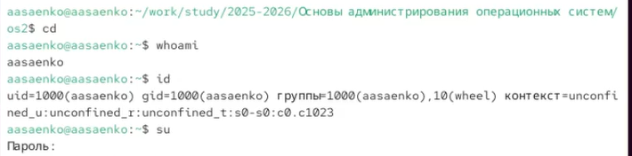{ #fig:001 width=80% }  

Снова набрала команду  id и увидела, что произошли некоторые изменения. Теперь uid и  gid  стали равны 0,так как включился режим суперпользователя. Также имена пользователя и основной группы стали равны root , исчезла группа wheel. После этого я вернулась к учётной записи своего пользователя. Это можно увидеть на следующем скриншоте.  

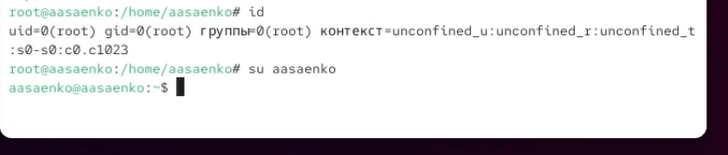{ #fig:002 width=80% }  

Затем я открыла файл `/etc/sudoers` с помощью утилиты `visudo`, чтобы посмотреть настройки доступа. Использую именно  visudo , так как эта утилита проверяет синтаксис файла перед сохранением , а обычные редакторы(vi, nano,mcedit) просто сохранят файл с ошибками. Содержимое файла видно на скриншоте.  

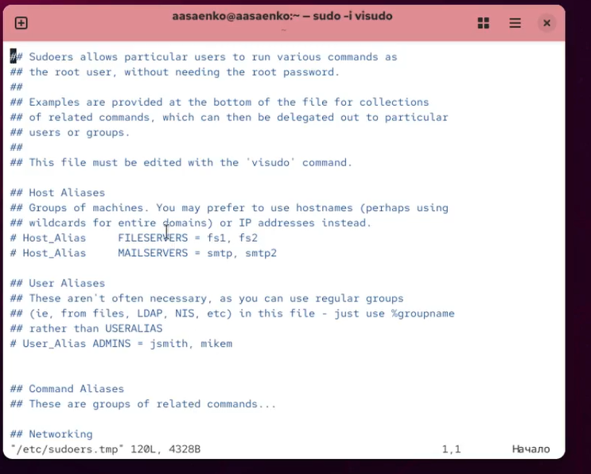{ #fig:003 width=80% }  

Не забуду убедиться, что в файле присутствует строка %wheel ALL=(ALL) ALL . Данная строка означает, что все члены группы  wheel  получают полные права суперпользователя. Группа  wheel  нужна для предоставления пользователям полных административных прав через  sudo  без необходимости делиться паролем  root. Наличие данной строчки можно увидеть ниже на скриншоте.  

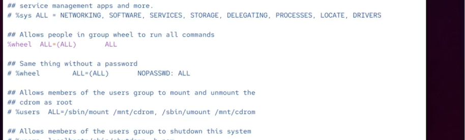{ #fig:004 width=80% }  

После этого я создала пользователя **alice**, добавила её в группу `wheel` и назначила пароль. Проверив вход, убедилась, что всё работает. После переключилась на учётную запись пользователя **alice**.  

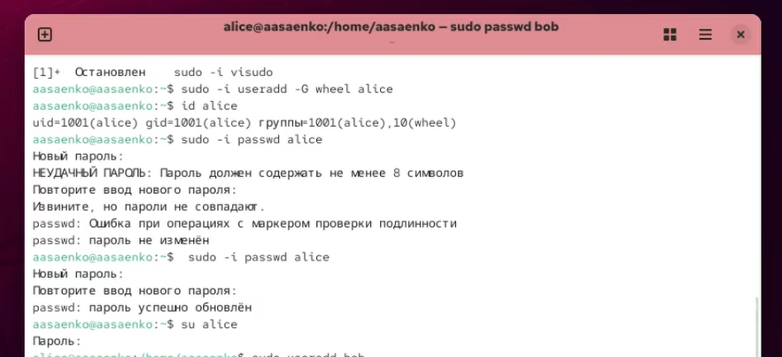{ #fig:005 width=80% }  

Аналогично я завела пользователя **bob** и тоже задала ему пароль. Проверку можно увидеть на скриншоте.  

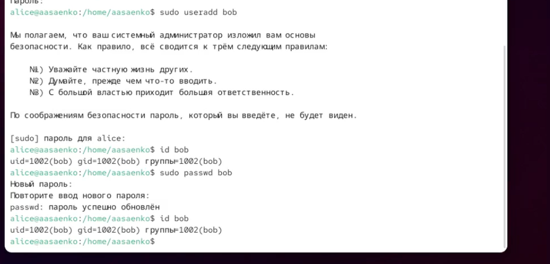{ #fig:006 width=80% }  

## Создание учётных записей  

Чтобы при добавлении новых пользователей автоматически создавались домашние каталоги, я изменила параметры в файле `/etc/login.defs`: включила `CREATE_HOME yes` и отключила `USERGROUPS_ENAB no`.  

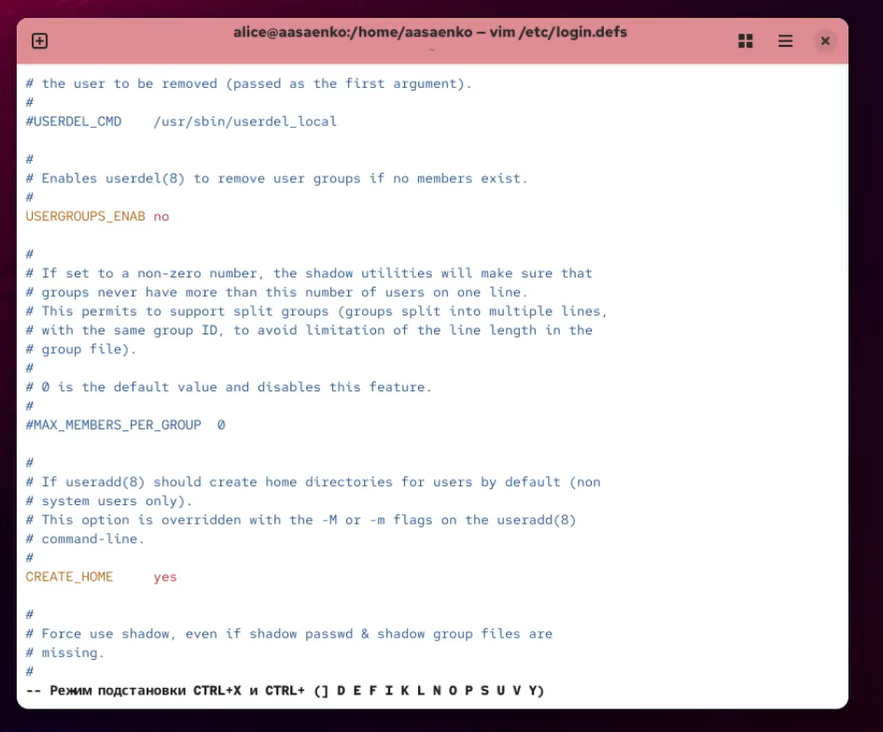{ #fig:007 width=80% }  

Кроме того, я изменила содержимое каталога `/etc/skel`: добавила стандартные директории.  

{ #fig:008 width=80% }  

 После этого подредактировала файл `.bashrc`, где указала редактор по умолчанию.  
 
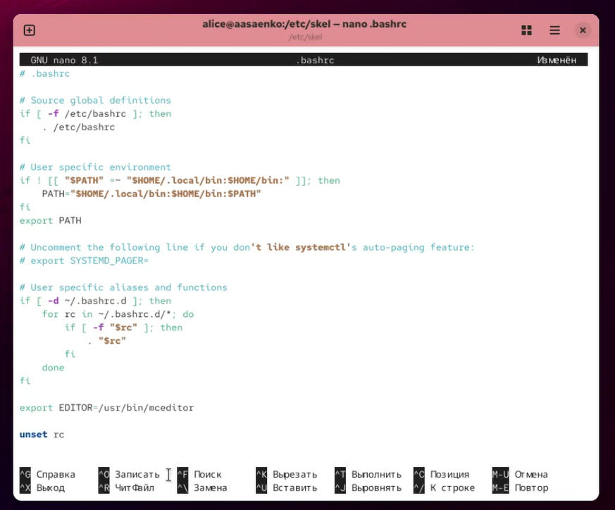{ #fig:009 width=80% }  

Далее я создала пользователя **carol**, задала ей пароль и настроила параметры действия пароля: минимальный срок — 30 дней, максимальный — 90 дней, предупреждение за 3 дня до истечения.  

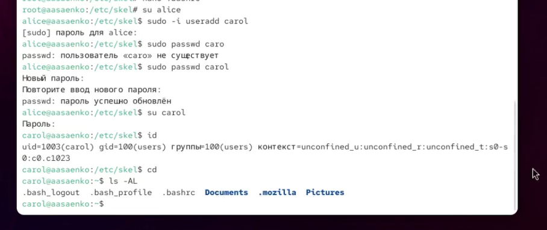{ #fig:010 width=80% }  

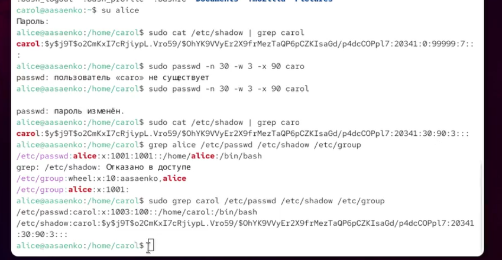{ #fig:011 width=80% }  

## Работа с группами  

Я создала группы `main` и `third`, после чего добавила alice и bob в группу `main`, а carol — в группу `third`. Затем проверила принадлежность пользователей к группам через команду `id`.  

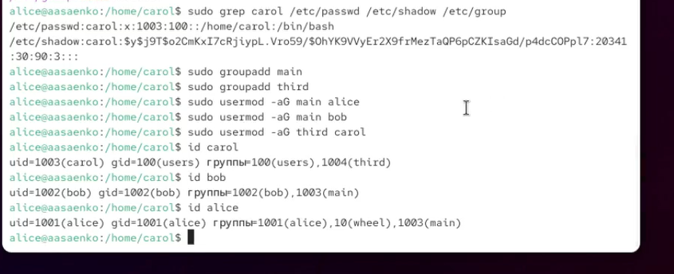{ #fig:012 width=80% }  

# Контрольные вопросы  

1. **Как определить UID и группы пользователя?**  
   Для этого можно использовать несколько команд:  
   - `id` — выводит UID, GID и список всех групп пользователя;  
   - `id -u` — показывает только UID;  
   - `id -G` — отображает идентификаторы групп;  
   - `groups` — выводит названия групп, в которых состоит пользователь.  

2. **Какой UID у пользователя root?**  
   У суперпользователя `root` всегда UID равен `0`. Проверить это можно командой `id root`.  

3. **В чём различие между `su` и `sudo`?**  
   - `su` (substitute user) полностью переключает с текущего пользователя на другого, чаще всего на root, и открывает его окружение.  
   - `sudo` (superuser do) выполняет отдельные команды от имени администратора или другого пользователя, при этом оставаясь в текущей сессии.  

4. **Где задаются параметры работы `sudo`?**  
   Настройки определяются в конфигурационном файле `/etc/sudoers`.  

5. **Как безопасно редактировать файл `sudoers`?**  
   Для этого применяется команда `visudo`. Она блокирует одновременное редактирование файла и проверяет синтаксис перед сохранением.  

6. **Какая группа предоставляет полный доступ через `sudo`?**  
   В большинстве дистрибутивов Linux это группа `wheel` (в Debian/Ubuntu часто используется группа `sudo`).  

7. **Какие файлы отвечают за параметры новых пользователей?**  
   - `/etc/login.defs` — глобальные параметры (создание домашнего каталога, политика паролей и т.д.);  
   - `/etc/default/useradd` — настройки по умолчанию для команды `useradd`;  
   - `/etc/skel/` — шаблон содержимого домашнего каталога для новых пользователей.  

8. **Где хранится информация о пользователях и группах?**  
   - `/etc/passwd` — содержит сведения о пользователях и их основных группах;  
   - `/etc/shadow` — хранит зашифрованные пароли и параметры их действия;  
   - `/etc/group` — описывает дополнительные группы и список участников.  

9. **Какие команды позволяют управлять сроком действия паролей?**  
   - `passwd` — изменение пароля пользователя;  
   - `chage` — настройка срока действия пароля (минимальный, максимальный срок, дата истечения, предупреждение о смене).  

10. **Можно ли вручную редактировать файл `/etc/group`?**  
    Напрямую вносить изменения в `/etc/group` не рекомендуется, так как это может привести к ошибкам. Корректнее использовать утилиты:  
    - `groupadd` — добавление новой группы;  
    - `groupdel` — удаление группы;  
    - `usermod` — изменение членства пользователей в группах.  

# Заключение  

В ходе выполнения лабораторной работы я научилась администрировать учётные записи пользователей и управлять группами в Linux.  
Были выполнены следующие действия:  
- определение текущего пользователя и вход под root;  
- создание новых пользователей и настройка паролей;  
- изменение системных параметров для автоматического формирования домашнего каталога;  
- редактирование шаблонных файлов в `/etc/skel`;  
- настройка политики паролей с помощью `chage`;  
- создание групп и распределение пользователей между ними.  

В процессе работы я закрепила знания о назначении файлов `/etc/passwd`, `/etc/shadow`, `/etc/group` и `/etc/sudoers`. Полученный опыт показал, как с помощью командной строки можно управлять многопользовательской системой, обеспечивать контроль доступа и повышать её безопасность.  

