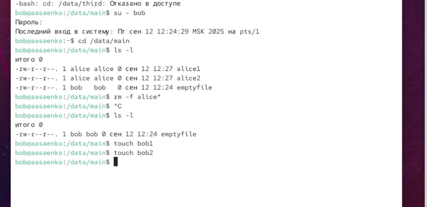
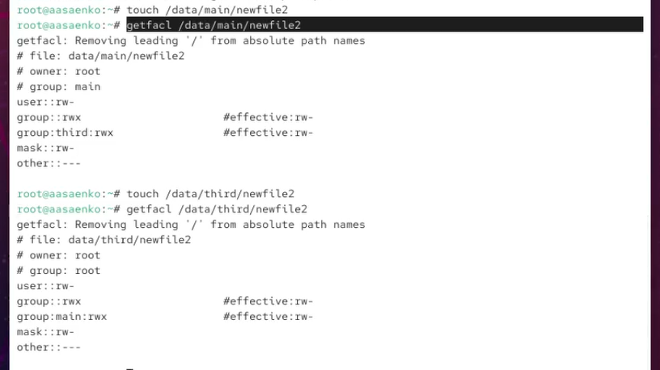
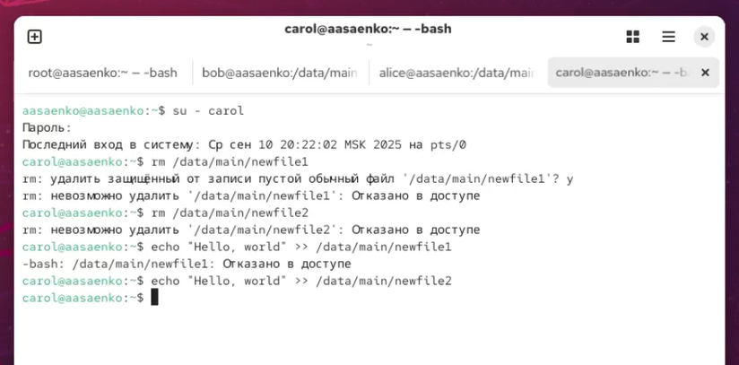

---
## Front matter
lang: ru-RU
title: Презентация по лабораторной работе №3
subtitle: Настройка прав доступа
author:
  - Саенко Ангелина Андреевна
institute:
  - Российский университет дружбы народов, Москва, Россия
date: 12 сентября 2025

## i18n babel
babel-lang: russian
babel-otherlangs: english

## Formatting pdf
toc: false
toc-title: Содержание
slide_level: 2
aspectratio: 169
section-titles: true
theme: metropolis
header-includes:
 - \metroset{progressbar=frametitle,sectionpage=progressbar,numbering=fraction}
---

# Цели и задачи работы

## Цель лабораторной работы

Получение навыков настройки базовых и специальных прав доступа для групп пользователей в операционной системе типа Linux. 

## Задачи лабораторной работы

1 Изучить команды управления правами доступа: chgrp, chmod, getfacl, setfacl. 
2 Создать структуру каталогов с разными уровнями доступа для групп пользователей. 
3 Настроить базовые разрешения с использованием традиционной системы прав Linux. 
4 Применить специальные разрешения (setgid и sticky bit) для безопасного обмена файлами. 
5 Поработать расширенными списками контроля доступа (ACL) для гибкого управления правами. 
6 Установить наследуемые ACL-правила для автоматического применения прав к новым файлам. 

# Ход выполнения работы

## Управление базовыми разрешениями

{ #fig:001 width=70% }

## Управление базовыми разрешениями

{ #fig:002 width=70% }

## Управление специальными разрешениями

{ #fig:003 width=70% }

## Управление специальными разрешениями

{ #fig:004 width=70% }

## Управление расширенными разрешениями с использованием списков ACL
{ #fig:005 width=70% }

## Управление расширенными разрешениями с использованием списков ACL

{ #fig:006 width=70% }

## Управление расширенными разрешениями с использованием списков ACL

{ #fig:007 width=70% }

## Управление расширенными разрешениями с использованием списков ACL

{ #fig:008 width=70% }

# Выводы по проделанной работе

## Вывод

В ходе лабораторной работы были освоены: 
- управление базовыми, специальными и расширенными правами доступа в Linux; 
- работа с командами chmod, chgrp, setfacl и getfacl;; 
- настройка разрешений для каталогов и файлов с использованием традиционной системы прав и ACL;; 
- применение специальных атрибутов (setgid и sticky bit) для безопасности данных; 
- настройка наследуемых ACL-правил для автоматического применения прав. 
