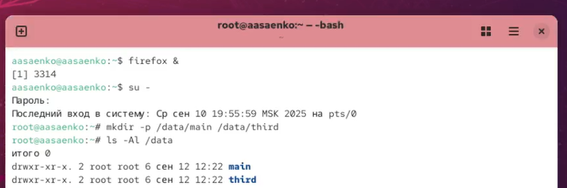
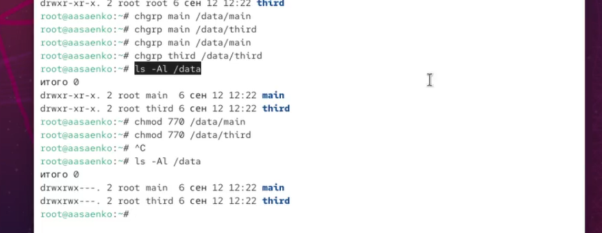
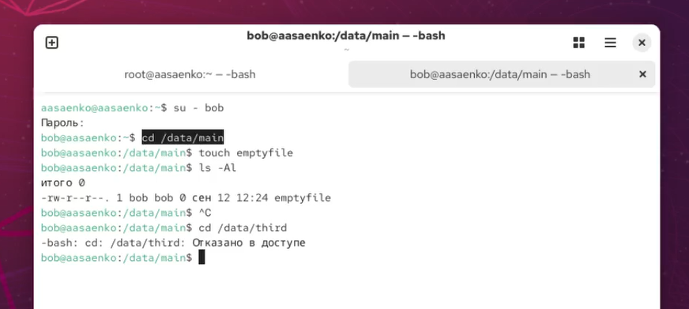
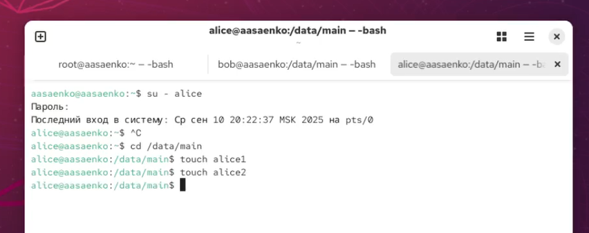
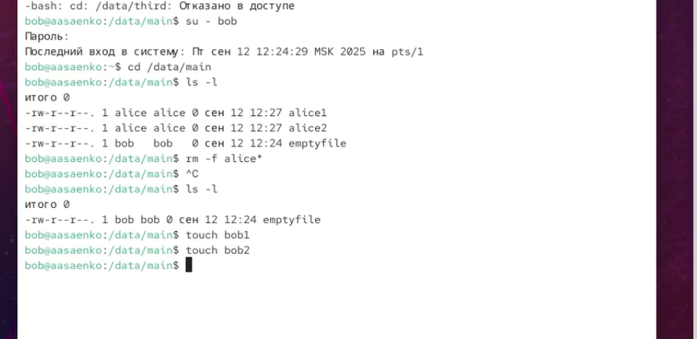
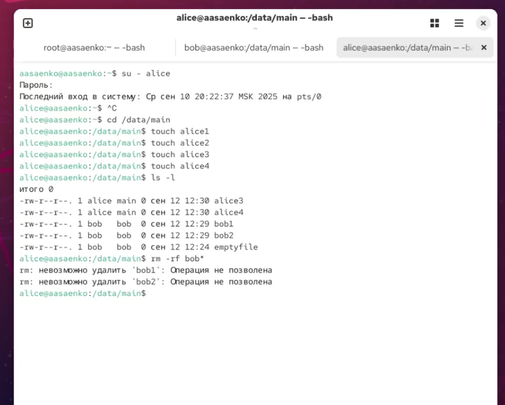
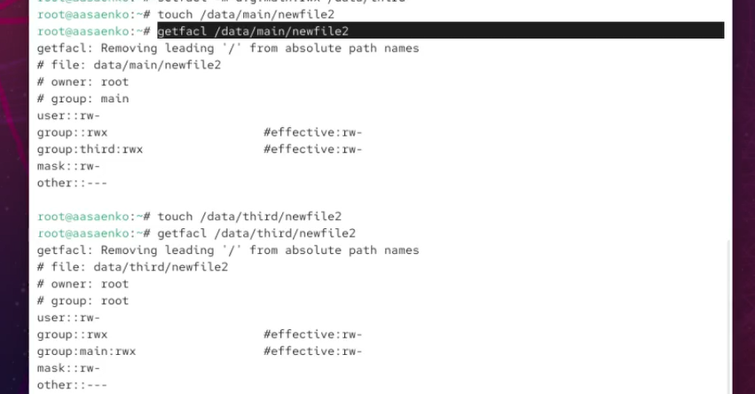
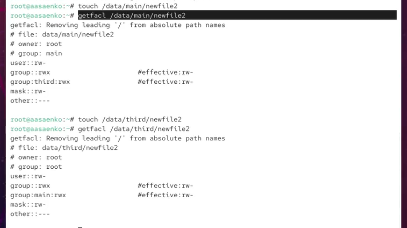

---
## Front matter
title: "Отчёт по лабораторной работе №3"
subtitle: "Настройка прав доступа"
author: "Саенко Ангелина Андреевна"

## Generic otions
lang: ru-RU
toc-title: "Содержание"

## Bibliography
bibliography: bib/cite.bib
csl: pandoc/csl/gost-r-7-0-5-2008-numeric.csl

## Pdf output format
toc: true
toc-depth: 2
lof: true
lot: true
fontsize: 12pt
linestretch: 1.5
papersize: a4
documentclass: scrreprt
## I18n polyglossia
polyglossia-lang:
  name: russian
  options:
    - spelling=modern
    - babelshorthands=true
polyglossia-otherlangs:
  name: english
## I18n babel
babel-lang: russian
babel-otherlangs: english
## Fonts
mainfont: IBM Plex Serif
romanfont: IBM Plex Serif
sansfont: IBM Plex Sans
monofont: IBM Plex Mono
mathfont: STIX Two Math
mainfontoptions: Ligatures=Common,Ligatures=TeX,Scale=0.94
romanfontoptions: Ligatures=Common,Ligatures=TeX,Scale=0.94
sansfontoptions: Ligatures=Common,Ligatures=TeX,Scale=MatchLowercase,Scale=0.94
monofontoptions: Scale=MatchLowercase,Scale=0.94,FakeStretch=0.9
mathfontoptions:
## Biblatex
biblatex: true
biblio-style: "gost-numeric"
biblatexoptions:
  - parentracker=true
  - backend=biber
  - hyperref=auto
  - language=auto
  - autolang=other*
  - citestyle=gost-numeric
## Pandoc-crossref LaTeX customization
figureTitle: "Рис."
tableTitle: "Таблица"
listingTitle: "Листинг"
lofTitle: "Список иллюстраций"
lotTitle: "Список таблиц"
lolTitle: "Листинги"
## Misc options
indent: true
header-includes:
  - \usepackage{indentfirst}
  - \usepackage{float}
  - \floatplacement{figure}{H}
---

# Цель работы  

Получение навыков настройки базовых и специальных прав доступа для групп пользователей в операционной системе типа Linux.  

# Ход выполнения работы  

## Управление базовыми разрешениями

Для создания структуры каталогов с разными разрешениями доступа для разных групп пользователей я открыла терминал с учётной записью root и в корневом каталоге создала каталоги /data/main и /data/third. Владельцем данных каталогов является root. Это можно увидеть на скриншоте ниже.  

{ #fig:001 width=80% }  

 Перед устновкой разрешений я изменила владельцев этих каталогов на main и  third. После чего сделала проверку и установила сами разрешения, позволяющие владельцам каталогов записывать файлы в эти каталоги и запрещающие доступ к содержимому каталогов всем другим пользователям и группам. После  сделала проверку. Это можно увидеть на скриншоте.  

{ #fig:002 width=80% }  

Затем я перешла под учётную запись пользователя **bob**, перешла в каталог  data/main и создала файл emptyfile в этом каталоге. Имя владельца и группы совпадают и равны  **bob**. Попробовав перейти под пользователем  **bob** в каталог /data/third, я получила отказ в доступе. Это произошло, так как **bob** входит в другую группу. Это можно увидеть ниже.  

{ #fig:003 width=80% }  

## Управление специальными разрешениями   

Открою новый терминал под пользователем **alice** и в каталоге /data/main создам два файла  alice1 и alice2. Выполнение можно увидеть ниже.  

{ #fig:004 width=80% }  

В другом терминале перейду под учётную запись  пользователя **bob**. В каталоге /data/main посмотрю файлы, созданные пользователем **alice**. После чего  удалю файлы, принадлежайшие  пользователю **alice** и создам новые файлы, которые принадлежат пользователю  **bob**. Это можете увидеть ниже на скриншоте.  

{ #fig:005 width=80% }  

 После этого под пользователем  root для каталога  /data/main установлю бит идентификатор группы, а также stiky-бит для разделяемого (общего) каталога группы.  
 
{ #fig:006 width=80% }  

Далее в терминале под пользователем **alice** создам в каталоге /data/main файлы alice3 и alice4. После чего в терминале под пользователем **alice** попробую удалить файлы, принадлежащие пользователю **bob**. Замечу, что sticky-bit предотвратит удаление этих файлов пользователем **alice**, поскольку этот пользователь не является владельцем этих файлов. Это вы можете увидеть на скриншоте.   

{ #fig:007 width=80% }  

## Управление расширенными разрешениями с использованием списков ACL

Под пользователем  root установлю права на чтение и выполнение в каталоге /data/main для группы third и права на чтение и выполнение для группы main в каталоге /data/third. Далее проверю правильность установки разрешений.  

{ #fig:008 width=80% }  

Создам новый файл с именем newfile1 в каталоге /data/main. Также проверю текущие значения полномочий. У данного файла такие права доступа : пользователь может как читать, так и писать, группа может только читать и другие могут только читать данный файл. Аналогичные действия выполню и для каталога /data/third. Права доступа в нём будут такие же, как и у первого каталога. Это можно увидеть ниже.  

{ #fig:009 width=80% }  

Далее я установлю ACL по умолчанию для каталога /data/main, после чего  добавлю ACL по умолчанию для каталога /data/third.

{ #fig:010 width=80% }  

Затем я проверю, что всё работает, добавив новый файл и проверю текущие назначения полномочий. После чего выполню аналогичные действия для второго каталога.

{ #fig:011 width=80% }  

Войду под учётной записью пользователя **carol**. Операции с файлами ниже мне не удастся выполнить, так как пользователь принадлежит другой группе. При этом запись в файл newfile2 я смогу сделать. Это можно увидеть ниже на скриншоте.  

{ #fig:012 width=80% }  

# Контрольные вопросы  

1. **Как следует использовать команду chown, чтобы установить владельца группы для файла?**  
   Для этого можно использовать несколько команд:  
   - `chown :группа файл` - устанавливает владельца группы для файла;  
   - `chown пользователь:группа файл` - одновременно устанавливает владельца и группу;  
   - `chown :группа каталог/*` - устанавливает группу для всех файлов в каталоге.  

2. **С помощью какой команды можно найти все файлы, принадлежащие конкретному пользователю?**  
   - `find / -user имя_пользователя` - поиск файлов по владельцу;  
   - `find / -uid UID_пользователя` - поиск по UID пользователя.  

3. **Как применить разрешения на чтение, запись и выполнение для всех файлов в каталоге /data для пользователей и владельцев групп, не устанавливая никаких прав для других?**  
   - `chmod -R ug+rwx /data` - устанавливает права rwx для пользователя и группы;  
   - `chmod -R o-rwx /data` - убирает все права для других.  

4. **Какая команда позволяет добавить разрешение на выполнение для файла, который необходимо сделать исполняемым?**  
   - `chmod +x файл` - добавляет право на выполнение для всех;  
   - `chmod u+x файл` - добавляет право на выполнение только для владельца.

5. **Какая команда позволяет убедиться, что групповые разрешения для всех новых файлов, создаваемых в каталоге, будут присвоены владельцу группы этого каталога?**  
   - `chmod g+s каталог` - устанавливает бит setgid для катало;  
   - `chmod 2775 каталог` - устанавливает права rwxrwxr-x с setgid битом.

6. **Необходимо, чтобы пользователи могли удалять только те файлы, владельцами которых они являются, или которые находятся в каталоге, владельцами которого они являются. С помощью какой команды можно это сделать?**  
   - `chmod +t каталог` - устанавливает sticky bit на каталог;  
   - `chmod 1777 каталог` - устанавливает права rwx для всех со sticky bit

7. **Какая команда добавляет ACL, который предоставляет членам группы права доступа на чтение для всех существующих файлов в текущем каталоге?**  
   - `setfacl -R -m g:группа:r *` - рекурсивно добавляет права чтения для группы;  
   - `setfacl -m g:группа:r файл` - добавляет права чтения для конкретного файла`.  

8. **Что нужно сделать для гарантии того, что члены группы получат разрешения на чтение для всех файлов в текущем каталоге и во всех его подкаталогах, а также для всех файлов, которые будут созданы в этом каталоге в будущем?**  
   - `setfacl -R -m g:группа:r каталог` - рекурсивно устанавливает права чтения;  
   - `setfacl -d -m g:группа:r каталог` - устанавливает права по умолчанию для новых файлов.  

9. **Какое значение umask нужно установить, чтобы «другие» пользователи не получали какие-либо разрешения на новые файлы?**  
   - `umask 007` - права только для владельца и группы (rwxrwx---);  
   - `umask 077` - права только для владельца (rwx------).  

10. **Какая команда гарантирует, что никто не сможет удалить файл myfile случайно?**  
    Напрямую вносить изменения в `/etc/group` не рекомендуется, так как это может привести к ошибкам. Корректнее использовать утилиты:  
   - `chattr +i myfile` - устанавливает атрибут "immutable" (неизменяемый);  
   - `chattr +a myfile` - устанавливает атрибут "append-only" (только дополнение).  

# Заключение  

В ходе выполнения лабораторной работы я приобрела практические навыки настройки базовых, специальных и расширенных прав доступа для групп пользователей в операционной системе Linux.  
Были выполнены следующие действия:  
- изучение команд управления правами доступа: chgrp, chmod, getfacl, setfacl;  
- создание иерархии каталогов с различными уровнями доступа для разных групп пользователей;  
- изменение системных параметров для автоматического формирования домашнего каталога;  
- настройка базовых разрешений с использованием традиционной системы прав Linux;  
- применение специальных разрешений (setgid и sticky bit) для обеспечения безопасного обмена файлами;  
- работа с расширенными списками контроля доступа (ACL) для гибкого управления правами;  
- установка наследуемых ACL-правил для автоматического применения прав к новым файлам.  

В процессе работы я закрепила понимание механизмов управления доступом в Linux, научилась настраивать права для совместной работы пользователей в группах, а также обеспечивать безопасность данных с помощью специальных атрибутов файловой системы. Полученный опыт показал важность корректной настройки прав доступа для многопользовательских сред.  

